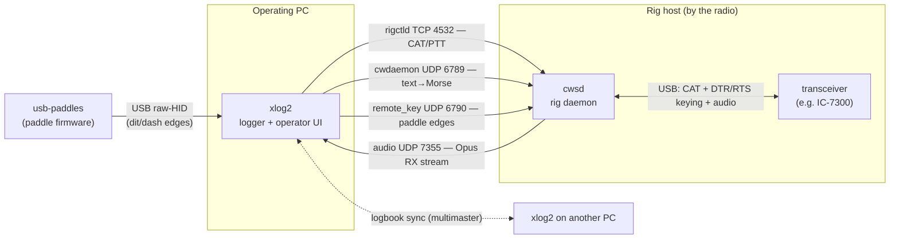

# hamtools

A small suite of **Linux ham-radio tools** by YO6SSW that work well on their own
and even better together. This repository is the **documentation entry point** —
it explains what each component is for, how to install it, how to use its
features, and how to combine them into a full (optionally remote) station.

| Component | What it is | Runs on | License | Latest |
|-----------|------------|---------|---------|--------|
| **[cwsd](https://github.com/yo6ssw/cwsd)** | CW/rig **daemon** — exposes the rig over the network (CAT, CW, audio, keying) | the machine wired to the rig | GPL-3.0 | v1.3.0 |
| **[xlog2](https://github.com/yo6ssw/xlog2)** | Desktop **logging program** (GTK 4 / Qt 6) | your operating PC | GPL-3.0 | v0.6.0 |
| **[usb-paddles](https://github.com/yo6ssw/usb-paddles)** | **Firmware** turning a Morse paddle into a USB device | an STM32 "Black Pill" | GPL-3.0 | v1.0.0 |

> A supporting library, **[multimaster](https://github.com/benishor/multimaster)**
> (LGPL-3.0), powers xlog2's logbook sync — you don't install it directly.

## How the pieces fit

Each tool is useful alone. Together they turn one rig into a fully network- and
internet-operable station:



The PC and the rig host can be the **same machine** (all local) or **different
machines on the LAN or across the internet** (remote operation) — the components
only ever talk over IP, so the topology is your choice.

---

# 1. cwsd — the rig daemon

## Purpose

`cwsd` runs next to your transceiver (developed against the Icom IC-7300) and
**publishes the rig on the network** through several independent, individually
toggled services:

| Service | Port | Purpose |
|---------|------|---------|
| `rigctld` | TCP 4532 | hamlib rigctld protocol — query/set frequency, mode, PTT, VFO (for WSJT-X, fldigi, xlog2…) |
| `cwdaemon` | UDP 6789 | receive text and key it as Morse (DTR=key, RTS=PTT) |
| audio stream | UDP 7355 | capture rig RX audio, Opus-encode, fan out to subscribers |
| remote key | UDP 6790 | replay timestamped **paddle** edges — real keying over the internet |

It links **hamlib** for CAT and drives the rig's serial control lines for keying.

## Install

**Ubuntu (PPA) — no compiling:**

```sh
sudo add-apt-repository ppa:benishor/hamtools
sudo apt update
sudo apt install cwsd
```

Other distros / Raspberry Pi OS: grab a self-contained static binary from the
[releases](https://github.com/yo6ssw/cwsd/releases) (`x86_64`/`arm64`), or build
from source:

```sh
sudo apt install libhamlib-dev libasound2-dev libopus-dev cmake build-essential
git clone https://github.com/yo6ssw/cwsd.git
cd cwsd
cmake -S . -B build -DCMAKE_BUILD_TYPE=Release
cmake --build build -j
sudo cmake --install build
```

Requires CMake ≥ 3.25 and a C++20 compiler.

> **After any hamlib upgrade, rebuild cwsd** — hamlib breaks CAT silently across
> 4.x ABI changes. See the cwsd README/CLAUDE.md.

## Configure

Config is YAML at `~/.config/cwsdrc` (copy `cwsdrc.sample`). Each service has an
`enabled` flag and a port; `rig.model` is the hamlib model number (e.g. `3073` =
IC-7300):

```yaml
rig:
  port: /dev/icom7300      # a stable udev symlink (see cwsd README)
  model: 3073
rigctld:   { enabled: true,  port: 4532 }
cwdaemon:  { enabled: true,  port: 6789, initial_wpm: 40 }
audio:     { enabled: false, port: 7355, device: plughw:0,0, sample_rate: 48000 }
remote_key:{ enabled: false, port: 6790, playout_ms: 150 }
```

## Use

```sh
cwsd            # run in the foreground
cwsd -d         # daemonize
cwsd --version
```

- **Standalone:** point any hamlib client at `HOST:4532` for CAT, or send text to
  UDP 6789 (cwdaemon protocol) to key CW. Great for running WSJT-X/fldigi against
  a rig on another machine.
- **As a service:** install the provided `shared/cwsd.service` systemd unit.
- The udev rule in `shared/` gives the rig a stable `/dev/icom7300` symlink.

> `cwdaemon` and `remote_key` both drive DTR/RTS — **don't enable both** on the
> same serial device; they're alternative keying front-ends.

---

# 2. xlog2 — the logger and operator UI

## Purpose

`xlog2` is a desktop **amateur-radio logging program** (a modern clone of the
classic `xlog`), built as a toolkit-neutral core with **two interchangeable
frontends**: `xlog2-gtk` (GTK 4) and `xlog2-qt` (Qt 6). Both read/write the same
`.xlog` (SQLite) logbooks and settings. Beyond logging, it is also the **operator
console** for the rest of the suite.

## Install

**Ubuntu (PPA) — no compiling:**

```sh
sudo add-apt-repository ppa:benishor/hamtools
sudo apt update
sudo apt install xlog2-gtk      # or: xlog2-qt
```

Optional: `xlog2-data` (world-map coastline), `xlog2-syncd` (headless sync peer).

**From source:**

```sh
sudo apt install build-essential cmake pkg-config \
  libgtkmm-4.0-dev qt6-base-dev libsqlite3-dev libhamlib-dev \
  libcurl4-openssl-dev libopus-dev libasound2-dev \
  libpipewire-0.3-dev libdbus-1-dev libsodium-dev
git clone --recurse-submodules https://github.com/yo6ssw/xlog2.git
cd xlog2 && cmake -S . -B build && cmake --build build -j
```

(Clone **with submodules** — xlog2 pulls in `multimaster`.)

## Features & how to use them

- **Logging:** tabular log with dupe detection, frequency→band auto-detect, ADIF
  import/export, per-band/mode statistics, multiple logbooks in tabs.
- **Network logging:** auto-logs QSOs pushed over UDP by WSJT-X ("Logged ADIF").
- **Rig control (hamlib):** polls frequency/mode and auto-fills the entry form.
- **DXCC / QRZ / LoTW:** entity + zone lookup from `cty.dat`; QRZ.com callsign
  prefill; LoTW upload (via `tqsl`) and confirmation download.
- **DX-cluster:** telnet band map with band-filter chips; double-click to tune.
- **CW keyer (cwdaemon):** F1–F9 macros that key CW through cwsd.
- **Rig audio:** plays a cwsd Opus RX stream through a local device.
- **CW Skimmer:** dockable multi-channel CW decoder over the rig-audio passband,
  with a waterfall, per-signal decode table, and Super-Check-Partial validation.
- **Remote paddle keying:** operator-side client for cwsd's `remote_key`.
- **Logbook sync:** peer-to-peer multi-master sync of your default logbook across
  machines (LAN auto-discovery + optional WAN peers), encrypted with a shared
  secret.

Run `xlog2-gtk` or `xlog2-qt`. Data lives under `~/.local/share/xlog2/`,
settings in `~/.config/xlog2/layout.ini`.

- **Standalone:** a complete logger on its own — log by hand, import/export ADIF,
  run DXCC/QRZ/LoTW, receive WSJT-X QSOs. No other component required.
- **Integrated:** point its rig/CW/audio/paddle features at a running cwsd (§4).

---

# 3. usb-paddles — the paddle firmware

## Purpose

Firmware for an **STM32F411 "Black Pill"** that turns two Morse-paddle contacts
(`PA0`=dit, `PA1`=dash) into a **vendor-defined (raw) USB HID device**. Because
it's *not* a keyboard, it never types into the focused window — only software that
knows the report format (xlog2) reads it. Sub-millisecond latency by design.

> The older STM32F103 "Blue Pill" variant lives on the `raw-hid` branch. The USB
> identity and report format are identical, so xlog2 reads either.

## Install (build & flash)

Built with **PlatformIO**, flashed over an **ST-Link/V2** on SWD:

```sh
git clone https://github.com/yo6ssw/usb-paddles.git
cd usb-paddles
pio run                 # build
pio run -t upload       # flash
```

Install the udev rule so a normal user can read the device:

```sh
sudo cp udev/60-xlog2-paddle.rules /etc/udev/rules.d/
sudo udevadm control --reload-rules && sudo udevadm trigger
```

Replug the board; confirm with `lsusb | grep 1eaf:0024`.

## Use

- **Standalone:** it's a clean, low-latency raw-HID paddle — any program that
  reads its 2-byte report (dit/dash bits + sequence counter) can use it. Wire each
  contact to GND (internal pull-ups).
- **Integrated:** xlog2's `HidPaddleInput` reads it; feed that into xlog2's iambic
  keyer for local CW or for **remote keying via cwsd** (§4).

---

# 4. Putting it together

All inter-component traffic is over IP, so "local" and "remote" are the same
setup with different addresses. Common scenarios:

### A. Remote-controlled station (CAT + digital modes)

Run **cwsd** on the rig host with `rigctld` enabled. On your PC, point **xlog2**
(or WSJT-X/fldigi) at `RIGHOST:4532`. You now control frequency/mode/PTT over the
network. Enable cwsd's **audio** service and subscribe from xlog2 to hear RX.

### B. CW operating over the network

Enable cwsd's **cwdaemon** service. In xlog2, configure the CW keyer to that host
and use F1–F9 macros / the entry field to send Morse — the rig keys remotely.

### C. Real paddle keying over the internet

The full chain: **usb-paddles → xlog2 → cwsd**.

1. Flash a Black Pill (§3) and plug it into your PC.
2. In xlog2, enable the **remote paddle keyer**, pointing at cwsd's `remote_key`
   service (UDP 6790). xlog2 runs the iambic keyer locally on the jitter-free
   paddle input and streams timestamped key edges.
3. On the rig host, enable cwsd's **remote_key** service. It replays the edges
   behind a fixed playout delay, so network jitter never distorts your Morse.
   xlog2 generates instant local sidetone; the on-air signal follows the delay
   (semi-break-in). Monitor RX via the cwsd audio stream.

> Enable **either** `cwdaemon` **or** `remote_key` on a given serial device, not
> both — they share the DTR/RTS lines.

### D. Rig audio + CW Skimmer

Enable cwsd's **audio** service; subscribe from xlog2 to play RX, and open
xlog2's **CW Skimmer** dock to decode every CW signal in the passband at once,
with callsign labels validated against a Super-Check-Partial list.

### E. Multi-machine logbook

Run xlog2 on several machines (or add `xlog2-syncd` as a headless backup peer)
with the same sync secret; the default logbook stays merged across all of them
via multimaster — LAN auto-discovery, with optional WAN peers.

### A minimal full remote setup

```
Rig host (by the radio):        Operating PC:
  cwsd, with enabled:             xlog2 (PPA install), configured to reach
    rigctld    (4532)               the rig host for rig control, CW/keying,
    remote_key (6790)               and audio; usb-paddles plugged in for
    audio      (7355)               real paddle keying.
```

---

## Project links

- **cwsd** — https://github.com/yo6ssw/cwsd
- **xlog2** — https://github.com/yo6ssw/xlog2
- **usb-paddles** — https://github.com/yo6ssw/usb-paddles
- **multimaster** (xlog2's sync library) — https://github.com/benishor/multimaster
- **Ubuntu PPA** — https://launchpad.net/~benishor/+archive/ubuntu/hamtools

Each repository has its own detailed `README.md` (and `CLAUDE.md` design notes),
`CONTRIBUTING.md`, and issue templates. Bug reports and contributions are welcome.

## License

The individual projects are licensed under **GPL-3.0-or-later** (multimaster under
**LGPL-3.0-or-later**). This documentation is provided under
[CC BY 4.0](https://creativecommons.org/licenses/by/4.0/).

73 · YO6SSW — Adrian Scripcă
